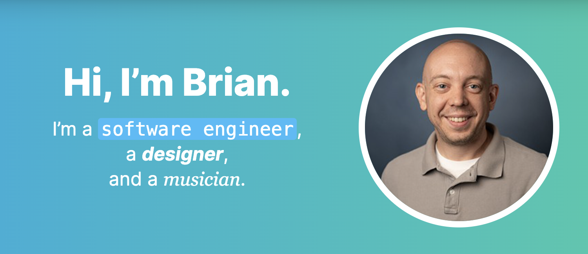

# BurgBits

Hi there! 👋 

Welcome to my readme file. This is the repo for my personal blog, [BurgBits](https://burgbits.com). Feel free to take a look around and let me know what you think at [bhamburg@gmail.com](mailto:bhamburg@gmail.com). Thanks!

## Tech Stack

- [Vue.js](https://vuejs.org/)
- [Nuxt](https://www.nuxt.org/)
- [Tailwind CSS](https://tailwindcss.com/)
- [Netlify](https://netlify.com/)

## License

This project is open-source under the MIT license.
